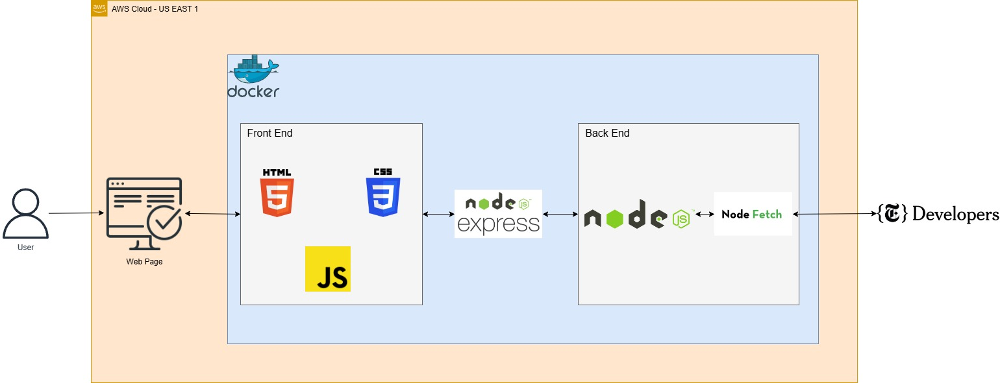

# Avaliação Sprint 2 - 3

Avaliação da segunda e terceira sprints do programa de bolsas Compass UOL para formação em machine learning para AWS.

***

## Descrição do projeto

O projeto consiste em consumir rotas da Books API, disponibilizada pela New York Times. É utilizado NodeJS para desenvolver a lógica do back-end e Docker para realizar a containerização do projeto. A aplicação é acessível através do deploy de uma instância EC2 na AWS.




***

## 📁 Estrutura do projeto

```plaintext
sprints-2-3-pb-aws-abril/
│
├── node_modules/           # Dependências do projeto gerenciadas pelo npm
│
├── public/                 # Arquivos públicos e estáticos
│   ├── css/
│   │   └── styles.css      # Estilos CSS
│   ├── js/
│   │   └── script.js       # Scripts JavaScript para o front-end
│   └── index.html          # Página HTML principal
│
├── src/                    # Código-fonte da aplicação
│   ├── controller/
│   │   └── bestSellers.js  # Controlador da rota bestSellers
│   │   └── names.js        # Controlador da rota names
│   │   └── overview.js     # Controlador da rota overview
│   │   └── reviews.js      # Controlador da rota review
│   ├── routes/             # Definições de rotas da aplicação
│   │   ├── best-sellers.js # Rota para best-sellers
│   │   ├── names.js        # Rota para nomes
│   │   ├── overview.js     # Rota para overview
│   │   └── reviews.js      # Rota para reviews
│   └── services/
│       └── service.js      # Serviços utilizados pelos controladores
│ 
├── docs/
│   ├── README.md           # Documentação do projeto
│   └── Arquitetura.jpg     # Imagem utilizada no README
│ 
├── .dockerignore           # Arquivo para ignorar arquivos e pastas no docker
├── .env                    # Arquivo de configuração de variáveis de ambiente
├── .gitignore              # Arquivo para ignorar arquivos e pastas no git
├── Dockerfile              # Arquivo de configuração do docker
├── package-lock.json       # Arquivo de bloqueio de versão gerado pelo npm
├── package.json            # Arquivo de configuração do npm com metadados do projeto
└── server.js               # Ponto de entrada da aplicação
```
***

## 🧠 Lógica do projeto

1. Ao acessar a porta hosteando o projeto, o usuário se depara com um formulário onde o mesmo pode utilizar de uma box de opções para selecionar qual das rotas da API deseja consumir.

2. O usuário informa os parâmetros necessários para a API selecionada e clica no botão de enviar, o botão irá ativar um 'eventListener' que consumirá a API.

3. Os dados retornados pela API são apresentados na partição ao lado. 

***

## 🛠️ Como rodar o sistema

1. Crie uma instância EC2.
2. Atualize os pacotes: `sudo yum update -y`
3. Instale o git: `sudo yum install git -y`
4. Instalar o npm: `sudo yum install npm -y`
5. Instale o docker: `sudo yum install docker -y`
6. Execute os seguintes comandos para iniciar o docker corretamente: 
	`sudo systemctl start docker`
	`sudo systemctl enable docker`
7. Instalar docker compose: `sudo curl -L "https://github.com/docker/compose/releases/download/$(curl -s https://api.github.com/repos/docker/compose/releases/latest | grep 'tag_name' | cut -d\" -f4)/docker-compose-$(uname -s)-$(uname -m)" -o /usr/local/bin/docker-compose`
8. Aplique permissões ao docker compose: `sudo chmod +x /usr/local/bin/docker-compose`
9. Reinicie a instância para as mudanças surtirem efeito
10. Clone o repositorio: `git clone https://github.com/Compass-pb-aws-2024-ABRIL/sprint-1-pb-aws-abril`
11. Navege até o diretório e altere para a branch grupo_1: `git chekout grupo_1`
12. Instale os pacotes npm: `npm install`
13. Crie um arquivo .env que conterá a variável de ambiente: `echo API_KEY=[API KEY] > .env`
14. Para iniciar o container, execute: `docker-compose up`
15. A aplicação é executada na porta `[PublicIP]:5000`

***

## 🖱️ Como utilizar o sistema
1. Acesse um dos IPs abaixo:
- I.
- II.
- III.
- IV.
2. O usuário possui a opção de selecionar dentre 4 opções de busca.
3. Na opção 'reviews', é necessário incluir ao menos 1 parâmetro.
4. É recomendado enviar apenas 5 requisições por minuto, com um espaçamento mínimo de 12 segundos entre elas, para garantir que a requisição seja corretamente consumida. Não respeitar essas recomendações cria uma chance em que requisição não seja corretamente tratada, não retornando nenhum valor.

***

## ✅ Tecnologias utilizadas

- `NodeJS`
- `HTML`
- `CSS`
- `Docker`

***

## ❌ Dificuldades no projeto

- Distribuição de tarefas de forma igualitária para que todos os desenvolvedores enfrentassem desafios que os aprimorassem e ainda não se senstissem nem deixados de lado quanto sobrecarregados.
- Impasse na escolha de tecnologias a serem utilizadas durante o projeto.
- Obstáculos na realização do deploy na AWS.

## 👨‍💻 Developers do projeto.

- [Rafael Alves Silva Rezende](https://github.com/rafa-rez)
- [José Acerbi Almeida Neto](https://github.com/JoseJaan)
- [Guilherme Padilha Jacon](https://github.com/guilhermepjacon)
- [João Victor de Morais Reis](https://github.com/jvmoraisreis)
